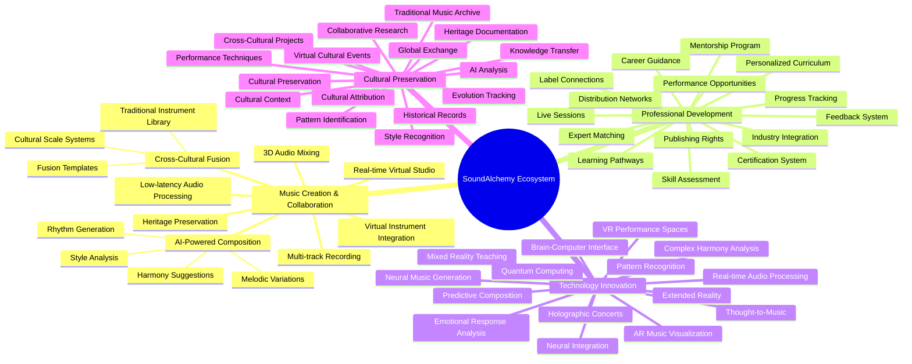

1. Complete Platform Ecosystem

## SoundAlchemy Ecosystem Mindmap

```mermaid
mindmap
  root((SoundAlchemy Ecosystem))
    Music Creation & Collaboration
      Real-time Virtual Studio
      Low-latency Audio Processing
      Multi-track Recording
      Virtual Instrument Integration
      3D Audio Mixing
      AI-Powered Composition
        Style Analysis
        Harmony Suggestions
        Rhythm Generation
        Melodic Variations
      Cross-Cultural Fusion
        Traditional Instrument Library
        Cultural Scale Systems
        Fusion Templates
      Heritage Preservation
    Professional Development
      Learning Pathways
      Personalized Curriculum
      Skill Assessment
      Progress Tracking
      Certification System
      Mentorship Program
      Live Sessions
      Expert Matching
      Feedback System
      Career Guidance
      Industry Integration
      Label Connections
      Performance Opportunities
      Publishing Rights
      Distribution Networks
    Technology Innovation
      Extended Reality
      VR Performance Spaces
      AR Music Visualization
      Mixed Reality Teaching
      Holographic Concerts
      Neural Integration
      Brain-Computer Interface
      Emotional Response Analysis
      Neural Music Generation
      Thought-to-Music
      Quantum Computing
      Complex Harmony Analysis
      Real-time Audio Processing
      Pattern Recognition
      Predictive Composition
    Cultural Preservation
      Cultural Preservation
      Heritage Documentation
      Traditional Music Archive
      Performance Techniques
      Cultural Context
      Historical Records
      AI Analysis
      Style Recognition
      Pattern Identification
      Cultural Attribution
      Evolution Tracking
      Global Exchange
      Cross-Cultural Projects
      Virtual Cultural Events
      Knowledge Transfer
      Collaborative Research
```
