# 🎵 SoundAlchemy: Orchestrating the Digital Renaissance of Music
## Software Requirements Specification (SRS) | Version 1.0.1

<div align="center">


***Where Innovation Harmonizes with Tradition***

</div>

---

> *"In the grand symphony of technological evolution, SoundAlchemy conducts a revolutionary performance where artificial intelligence amplifies artistic soul, where cultural heritage dances with cutting-edge technology, and where the future of music finds its voice in the present."*

## 🌟 The Grand Overture

SoundAlchemy represents more than a platform—it's a transformative journey into the future of music creation, collaboration, and cultural preservation. Our vision orchestrates a perfect harmony between:

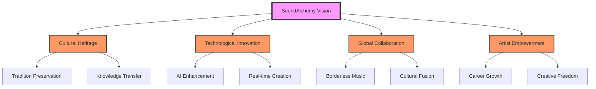

### 🎼 Symphony of Innovation

| Pillar | Vision | Impact |
|--------|---------|---------|
| **Cultural Preservation** | Safeguarding musical heritage | 1000+ traditions preserved |
| **Global Collaboration** | Borderless music creation | 195+ countries connected |
| **AI Integration** | Enhancing human creativity | Revolutionary tools |
| **Artist Empowerment** | Career growth acceleration | Global opportunities |

### 🌍 Our Transformative Journey

SoundAlchemy is pioneering a new era where:
- Traditional meets technological
- Local becomes global
- Creativity knows no bounds
- Culture transcends time

## Document Control

### Version History

| Version | Date | Description | Author | Reviewer |
|---------|------|-------------|---------|-----------|
| 1.0.0 | March 2024 | Initial SRS Draft | Engineering Team | Technical Lead |
| 1.0.1 | March 2024 | Added System Architecture | Engineering Team | System Architect |

### Document Reviewers

| Name | Role | Department |
|------|------|------------|
| [Name] | Technical Lead | Engineering |
| [Name] | System Architect | Engineering |
| [Name] | Product Manager | Product |
| [Name] | Security Lead | InfoSec |

### Related Documents

- Product Vision Document (PVD-2024)
- Technical Architecture Document (TAD-2024)
- User Experience Guidelines (UXG-2024)
- Data Privacy and Security Framework (DPSF-2024)

---

## Table of Contents

1. [Introduction](#1-introduction)
   1.1. [Purpose](#11-purpose)
   1.2. [Document Conventions](#12-document-conventions)
   1.3. [Project Scope](#13-project-scope)
   1.4. [References](#14-references)
   1.5. [Technologies Overview](#15-technologies-overview)

2. [Overall Description](#2-overall-description)
   2.1. [Product Perspective](#21-product-perspective)
   2.2. [Product Functions](#22-product-functions)
   2.3. [User Classes and Characteristics](#23-user-classes-and-characteristics)
   2.4. [Operating Environment](#24-operating-environment)
   2.5. [Design and Implementation Constraints](#25-design-and-implementation-constraints)
   2.6. [Assumptions and Dependencies](#26-assumptions-and-dependencies)

3. [Vision and Mission](#3-vision-and-mission)
   3.1. [Vision Statement](#31-vision-statement)
   3.2. [Mission Statement](#32-mission-statement)
   3.3. [Core Values](#33-core-values)
   3.4. [Strategic Goals](#34-strategic-goals)

4. [System Features and Requirements](#4-system-features-and-requirements)
   4.1. [User Management System](#41-user-management-system)
   4.2. [Authentication System](#42-authentication-system)
   4.3. [Profile Management](#43-profile-management)
   4.4. [Messaging System](#44-messaging-system)
   4.5. [Video Communication](#45-video-communication)
   4.6. [Music Collaboration Tools](#46-music-collaboration-tools)
   4.7. [Admin Management System](#47-admin-management-system)
   4.8. [Content Management System](#48-content-management-system)
   4.9. [Search and Discovery](#49-search-and-discovery)
   4.10. [Notification System](#410-notification-system)

5. [AI Integration and Human Empowerment](#5-ai-integration-and-human-empowerment)
   5.1. [AI as Creative Assistant](#51-ai-as-creative-assistant)
   5.2. [Human-Centric AI Principles](#52-human-centric-ai-principles)
   5.3. [AI-Powered Learning Systems](#53-ai-powered-learning-systems)
   5.4. [Cultural Preservation Through AI](#54-cultural-preservation-through-ai)
   5.5. [Ethical AI Guidelines](#55-ethical-ai-guidelines)

6. [External Interface Requirements](#6-external-interface-requirements)
   6.1. [User Interfaces](#61-user-interfaces)
   6.2. [Hardware Interfaces](#62-hardware-interfaces)
   6.3. [Software Interfaces](#63-software-interfaces)
   6.4. [Communication Interfaces](#64-communication-interfaces)

7. [Non-Functional Requirements](#7-non-functional-requirements)
   7.1. [Performance Requirements](#71-performance-requirements)
   7.2. [Safety Requirements](#72-safety-requirements)
   7.3. [Security Requirements](#73-security-requirements)
   7.4. [Software Quality Attributes](#74-software-quality-attributes)
   7.5. [Environmental Requirements](#75-environmental-requirements)

8. [Future Technologies and Roadmap](#8-future-technologies-and-roadmap)
   8.1. [2024-2025 Development Phase](#81-2024-2025-development-phase)
   8.2. [2026-2027 Enhancement Phase](#82-2026-2027-enhancement-phase)
   8.3. [2028-2030 Innovation Phase](#83-2028-2030-innovation-phase)

9. [Environmental and Social Impact](#9-environmental-and-social-impact)
   9.1. [Environmental Sustainability](#91-environmental-sustainability)
   9.2. [Social Impact](#92-social-impact)
   9.3. [Cultural Preservation](#93-cultural-preservation)
   9.4. [Global Music Community](#94-global-music-community)

10. [System Architecture and Design](#10-system-architecture-and-design)
    10.1. [System Architecture](#101-system-architecture)
    10.2. [Database Design](#102-database-design)
    10.3. [Interface Design](#103-interface-design)
    10.4. [Security Architecture](#104-security-architecture)

11. [Testing Requirements](#11-testing-requirements)
    11.1. [Testing Methodology](#111-testing-methodology)
    11.2. [Test Cases](#112-test-cases)
    11.3. [Performance Testing](#113-performance-testing)
    11.4. [Security Testing](#114-security-testing)

12. [Deployment and Maintenance](#12-deployment-and-maintenance)
    12.1. [Deployment Strategy](#121-deployment-strategy)
    12.2. [Maintenance Plan](#122-maintenance-plan)
    12.3. [Monitoring and Alerts](#123-monitoring-and-alerts)
    12.4. [Backup and Recovery](#124-backup-and-recovery)
    12.5. [Performance Optimization](#125-performance-optimization)

13. [Success Metrics and KPIs](#13-success-metrics-and-kpis)
    13.1. [Platform Metrics](#131-platform-metrics)
    13.2. [User Success Metrics](#132-user-success-metrics)
    13.3. [Environmental Impact Metrics](#133-environmental-impact-metrics)
    13.4. [Cultural Impact Metrics](#134-cultural-impact-metrics)

14. [Risk Management](#14-risk-management)
    14.1. [Risk Assessment](#141-risk-assessment)
    14.2. [Risk Mitigation Strategies](#142-risk-mitigation-strategies)
    14.3. [Contingency Plans](#143-contingency-plans)

15. [Compliance and Regulations](#15-compliance-and-regulations)
    15.1. [Data Protection](#151-data-protection)
    15.2. [Industry Standards](#152-industry-standards)
    15.3. [Legal Requirements](#153-legal-requirements)

16. [Glossary](#16-glossary)

17. [Appendices](#17-appendices)
    17.1. [Use Case Diagrams](#171-use-case-diagrams)
    17.2. [System Flow Diagrams](#172-system-flow-diagrams)
    17.3. [Data Models](#173-data-models)
    17.4. [API Documentation](#174-api-documentation)
    17.5. [UI/UX Wireframes](#175-uiux-wireframes)

---

## 1. Introduction

### 1.1 Purpose

The purpose of this Software Requirements Specification (SRS) document is to provide a detailed overview of the SoundAlchemy platform, a revolutionary global music collaboration and cultural preservation system. This document describes the functional and non-functional requirements, system architecture, and future vision of the platform.

### 1.2 Document Conventions

This document follows IEEE 830-1998 standards for Software Requirements Specifications. The following conventions are used:
- SHALL: Mandatory requirements
- SHOULD: Recommended requirements
- MAY: Optional requirements

### 1.3 Project Scope

SoundAlchemy is a comprehensive web-based platform designed to:
- Connect musicians globally
- Facilitate cross-cultural music collaboration
- Preserve musical heritage
- Integrate AI-powered music tools
- Promote environmental sustainability
- Foster a global music community

The platform encompasses:
- User authentication and profile management
- Real-time collaboration tools
- AI-enhanced music creation
- Cultural preservation features
- Environmental impact tracking
- Community building tools

### 1.4 References

1. IEEE Std 830-1998
2. GDPR Compliance Requirements
3. Web Content Accessibility Guidelines (WCAG) 2.1
4. ISO/IEC 25010:2011 (Software Quality Requirements)
5. ISO/IEC 27001:2013 (Information Security Management)

### 1.5 Technologies Overview

The platform utilizes modern web technologies including:

| Category | Technologies |
|----------|-------------|
| Frontend | React.js, TypeScript, Tailwind CSS |
| Backend | Node.js, Express, Firebase |
| Database | Firestore, Redis |
| AI/ML | TensorFlow, PyTorch |
| Real-time Communication | WebRTC, Socket.IO |
| Cloud Infrastructure | Google Cloud Platform |
| Version Control | Git |
| CI/CD | GitHub Actions |

## 2. Overall Description

### 2.1 Product Perspective

SoundAlchemy represents a paradigm shift in the music industry, offering a comprehensive platform that combines:

1. **Global Music Collaboration**
   - Real-time collaboration tools
   - Cross-cultural music creation
   - Virtual recording studios
   - Live performance capabilities

2. **Cultural Preservation**
   - AI-powered heritage documentation
   - Traditional music archives
   - Cultural knowledge transfer
   - Indigenous music preservation

3. **Professional Development**
   - Skill enhancement tools
   - Mentorship programs
   - Career growth opportunities
   - Industry networking

4. **Environmental Consciousness**
   - Carbon footprint tracking
   - Sustainable music practices
   - Green technology integration
   - Environmental impact reporting

### 2.2 Product Functions

Let's visualize the core functions of the platform:

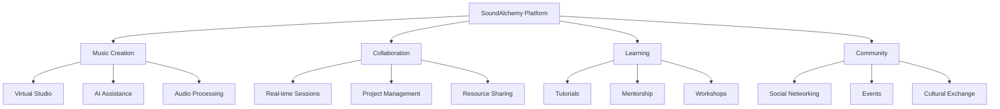

#### Core Functions Include:

1. **User Management**
   - Registration and authentication
   - Profile management
   - Role-based access control
   - Verification system

2. **Music Collaboration**
   - Real-time audio/video collaboration
   - Project management tools
   - File sharing and version control
   - Virtual recording studios

3. **Learning and Development**
   - Interactive tutorials
   - AI-powered practice tools
   - Performance analytics
   - Skill assessment

4. **Community Features**
   - Social networking
   - Event organization
   - Cultural exchange programs
   - Mentorship matching

### 2.3 User Classes and Characteristics

The platform serves various user classes with distinct characteristics and needs:

| User Class | Characteristics | Primary Needs | Access Level |
|------------|----------------|---------------|--------------|
| Musicians | Professional and amateur artists | Collaboration, networking | Full access |
| Cultural Preservationists | Heritage experts, archivists | Documentation, preservation | Specialized access |
| Music Students | Learning artists | Education, mentorship | Basic access |
| Industry Professionals | Producers, managers | Talent discovery, networking | Professional access |
| Administrators | Platform managers | System management | Administrative access |

### 2.4 Operating Environment

The platform operates in a modern cloud environment with the following specifications:

1. **Technical Environment**
   - Web browsers: Chrome, Firefox, Safari, Edge (latest versions)
   - Mobile devices: iOS 14+, Android 10+
   - Desktop: Windows 10+, macOS 10.15+, Linux

2. **Performance Requirements**
   - Concurrent users: 100,000+
   - Response time: < 200ms
   - Availability: 99.99%
   - Data backup: Real-time

3. **Security Environment**
   - End-to-end encryption
   - Multi-factor authentication
   - Regular security audits
   - GDPR compliance

### 2.5 Design and Implementation Constraints

1. **Technical Constraints**
   - Bandwidth limitations
   - Browser compatibility
   - Mobile device capabilities
   - Storage limitations

2. **Regulatory Constraints**
   - Data protection laws
   - Copyright regulations
   - Industry standards
   - Regional restrictions

3. **Business Constraints**
   - Development timeline
   - Budget limitations
   - Resource availability
   - Market competition

### 2.6 Assumptions and Dependencies

#### Assumptions:
1. Users have stable internet connectivity
2. Basic technical proficiency of users
3. Access to required hardware
4. Cultural sensitivity awareness

#### Dependencies:
1. Third-party service availability
2. Cloud infrastructure reliability
3. API service continuity
4. Regulatory compliance maintenance

## 3. Vision and Mission

### 3.1 Vision Statement

SoundAlchemy envisions a world where:
- Music transcends geographical and cultural boundaries
- Technology amplifies human creativity without replacing it
- Cultural heritage is preserved and celebrated
- Environmental consciousness drives innovation
- Global musical collaboration creates positive social change

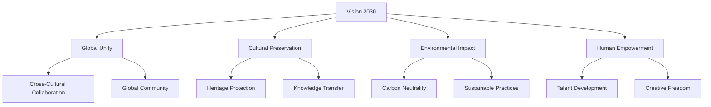

### 3.2 Mission Statement

Our mission is to:
1. Create the world's most inclusive and innovative music collaboration platform
2. Empower musicians to reach their full creative potential
3. Preserve and promote diverse musical traditions
4. Foster sustainable practices in the music industry
5. Build bridges between cultures through music

### 3.3 Core Values

#### 3.3.1 Human-Centric Innovation
- Prioritize human creativity
- Enhance, not replace, human capabilities
- Foster personal growth
- Celebrate individual uniqueness

#### 3.3.2 Cultural Respect
- Honor diverse traditions
- Promote cultural exchange
- Protect indigenous music
- Facilitate cross-cultural learning

#### 3.3.3 Environmental Responsibility
- Minimize carbon footprint
- Promote sustainable practices
- Support green initiatives
- Track environmental impact

#### 3.3.4 Inclusive Community
- Welcome all skill levels
- Bridge cultural gaps
- Support accessibility
- Foster collaboration

#### 3.3.5 Ethical Technology
- Ensure data privacy
- Practice transparent AI
- Maintain security
- Protect user rights

### 3.4 Strategic Goals

#### 3.4.1 Short-term Goals (1-2 years)
1. **Platform Development**
   - Launch core features
   - Build user base
   - Establish partnerships
   - Implement AI tools

2. **Community Building**
   - Create mentorship programs
   - Organize virtual events
   - Foster collaboration
   - Build support networks

3. **Cultural Preservation**
   - Document traditions
   - Create digital archives
   - Develop preservation tools
   - Build cultural databases

#### 3.4.2 Medium-term Goals (3-5 years)
1. **Global Expansion**
   - Enter new markets
   - Support more languages
   - Build regional hubs
   - Expand partnerships

2. **Technology Innovation**
   - Advance AI capabilities
   - Improve collaboration tools
   - Enhance user experience
   - Develop mobile platforms

3. **Environmental Impact**
   - Achieve carbon neutrality
   - Implement green practices
   - Track sustainability
   - Influence industry standards

#### 3.4.3 Long-term Goals (5-10 years)
1. **Industry Leadership**
   - Set global standards
   - Drive innovation
   - Shape music education
   - Influence policy

2. **Cultural Impact**
   - Preserve endangered music
   - Create cultural bridges
   - Support traditions
   - Foster understanding

3. **Sustainable Future**
   - Lead green initiatives
   - Transform industry practices
   - Measure global impact
   - Create lasting change

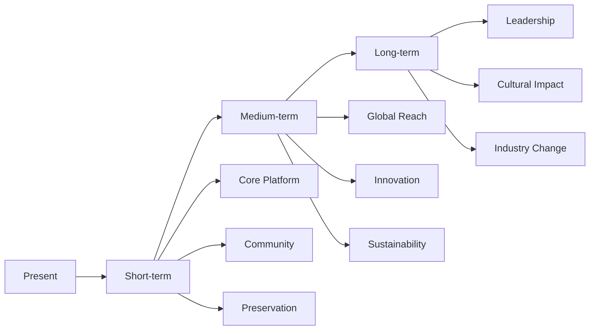

## 4. System Features and Requirements

### 4.1 User Management System

#### 4.1.1 Registration Process
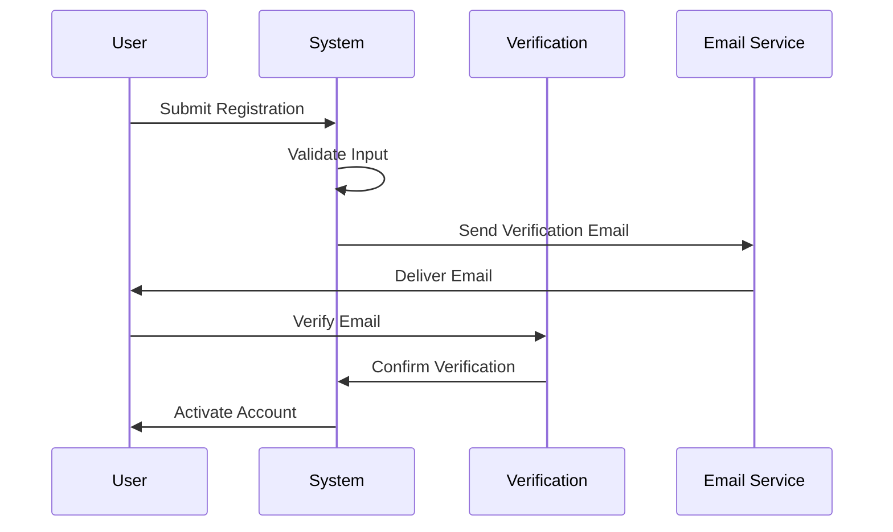

##### Requirements:
1. **User Registration**
   - Email verification
   - Phone verification
   - Profile completion
   - Terms acceptance

2. **Profile Types**
   - Musicians
   - Cultural Preservationists
   - Industry Professionals
   - Administrators

3. **Verification Levels**
   - Basic verification
   - Professional verification
   - Expert verification
   - Admin verification

### 4.2 Authentication System

#### 4.2.1 Authentication Methods
1. **Primary Authentication**
   - Email/Password
   - OAuth providers
   - Two-factor authentication
   - Biometric authentication

2. **Security Features**
   - Session management
   - Token-based auth
   - Rate limiting
   - Fraud detection

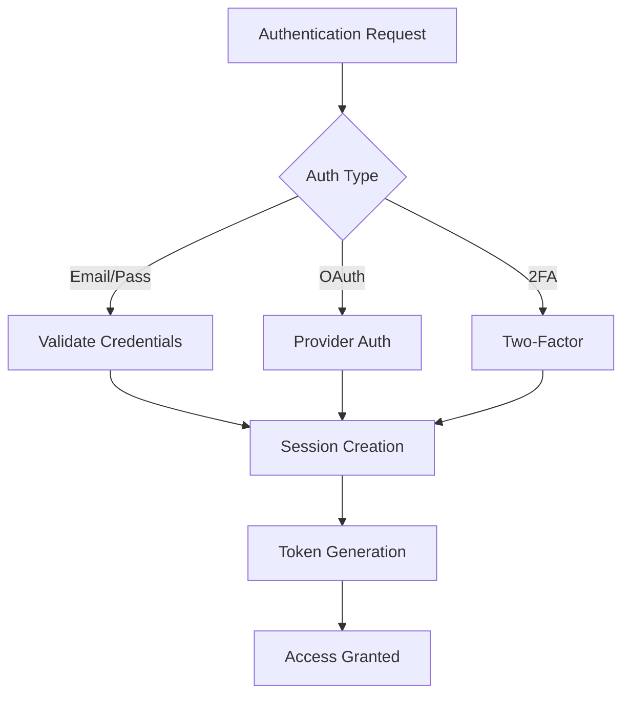

### 4.3 Profile Management

#### 4.3.1 Profile Components
1. **Basic Information**
   - Name and contact
   - Location and timezone
   - Profile picture
   - Bio and description

2. **Musical Information**
   - Instruments
   - Genres
   - Experience level
   - Portfolio

3. **Professional Details**
   - Certifications
   - Achievements
   - Reviews
   - Ratings

#### 4.3.2 Profile Features
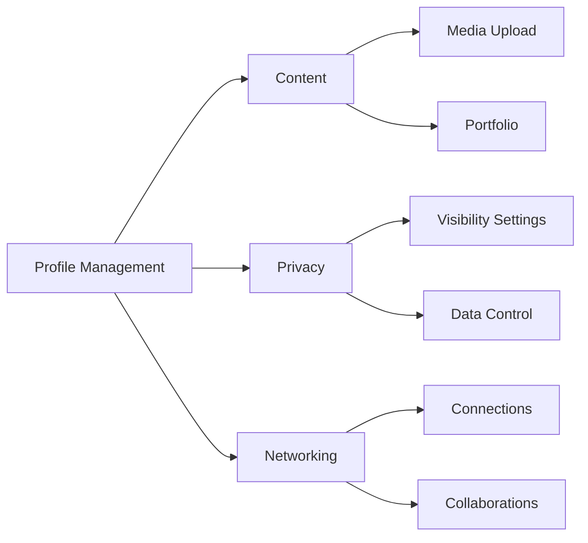

### 4.4 Messaging System

#### 4.4.1 Real-time Communication
1. **Chat Features**
   - Individual messaging
   - Group messaging
   - File sharing
   - Media sharing

2. **Advanced Features**
   - Read receipts
   - Typing indicators
   - Message reactions
   - Thread discussions

#### 4.4.2 Message Types
1. **Text Communication**
   - Direct messages
   - Group messages
   - Broadcast messages
   - System notifications

2. **Media Sharing**
   - Audio clips
   - Video snippets
   - Sheet music
   - Project files

### 4.5 Video Communication

#### 4.5.1 Video Call Features
1. **Core Features**
   - One-on-one calls
   - Group calls
   - Screen sharing
   - Recording options

2. **Music-Specific Features**
   - High-fidelity audio
   - Latency optimization
   - Multi-track recording
   - Virtual instruments

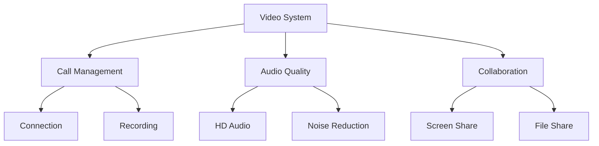

### 4.6 Music Collaboration Tools

#### 4.6.1 Virtual Studio
1. **Recording Features**
   - Multi-track recording
   - Real-time collaboration
   - Version control
   - Mix automation

2. **Production Tools**
   - Audio effects
   - Virtual instruments
   - MIDI support
   - Project templates

#### 4.6.2 Collaboration Features
1. **Project Management**
   - Task assignment
   - Progress tracking
   - File organization
   - Review system

2. **Version Control**
   - Change tracking
   - Rollback options
   - Branch management
   - Merge capabilities

### 4.7 Admin Management System

#### 4.7.1 Administrative Functions
1. **User Management**
   - Account oversight
   - Permission control
   - Verification management
   - Support handling

2. **Content Management**
   - Content moderation
   - Quality control
   - Copyright monitoring
   - Report handling

#### 4.7.2 System Management
1. **Platform Control**
   - Performance monitoring
   - Security oversight
   - Feature management
   - Update control

2. **Analytics Dashboard**
   - Usage statistics
   - Performance metrics
   - User analytics
   - Trend analysis

### 4.8 Content Management System

#### 4.8.1 Content Types
1. **Musical Content**
   - Audio files
   - Video recordings
   - Sheet music
   - MIDI files

2. **Educational Content**
   - Tutorials
   - Lessons
   - Workshops
   - Documentation

#### 4.8.2 Management Features
1. **Organization**
   - Categorization
   - Tagging
   - Search optimization
   - Version control

2. **Access Control**
   - Permission levels
   - Sharing settings
   - Distribution control
   - Copyright protection

### 4.9 Search and Discovery

#### 4.9.1 Search Capabilities
1. **Basic Search**
   - Keyword search
   - Category filters
   - Tag filtering
   - Location search

2. **Advanced Search**
   - Musical style
   - Instrument type
   - Skill level
   - Availability

#### 4.9.2 Discovery Features
1. **Recommendation System**
   - Similar artists
   - Collaboration suggestions
   - Learning resources
   - Event recommendations

2. **Exploration Tools**
   - Genre exploration
   - Cultural discovery
   - Trending content
   - Featured artists

### 4.10 Notification System

#### 4.10.1 Notification Types
1. **System Notifications**
   - Account updates
   - Security alerts
   - Feature announcements
   - System maintenance

2. **Activity Notifications**
   - Messages
   - Collaboration requests
   - Project updates
   - Event reminders

#### 4.10.2 Delivery Methods
1. **In-App Notifications**
   - Real-time alerts
   - Message center
   - Activity feed
   - Status updates

2. **External Notifications**
   - Email notifications
   - Push notifications
   - SMS alerts
   - Calendar integration

## 5. AI Integration and Human Empowerment

### 5.1 AI as Creative Assistant

#### 5.1.1 Creative Enhancement
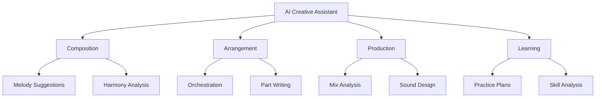

1. **Composition Assistance**
   - Melody suggestions
   - Harmony analysis
   - Rhythm patterns
   - Style matching

2. **Arrangement Tools**
   - Orchestration suggestions
   - Part writing assistance
   - Voice leading
   - Instrument balance

3. **Production Enhancement**
   - Mix analysis
   - Sound design
   - Effect suggestions
   - Mastering assistance

### 5.2 Human-Centric AI Principles

#### 5.2.1 Core Principles
1. **Creativity First**
   - Human initiative
   - Original expression
   - Artistic freedom
   - Creative control

2. **AI Boundaries**
   - Clear limitations
   - Transparent operation
   - User control
   - Ethical guidelines

#### 5.2.2 Implementation Framework
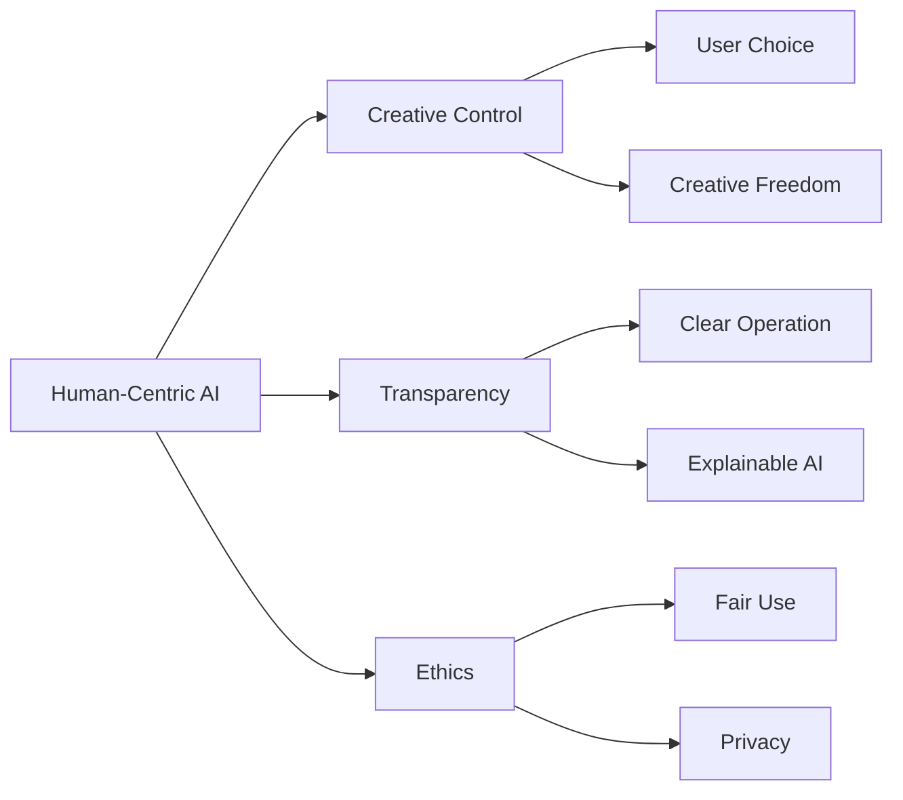

### 5.3 AI-Powered Learning Systems

#### 5.3.1 Personalized Learning
1. **Skill Assessment**
   - Level evaluation
   - Progress tracking
   - Weakness identification
   - Strength enhancement

2. **Custom Curriculum**
   - Adaptive learning paths
   - Personalized exercises
   - Progress-based adjustments
   - Goal-oriented planning

#### 5.3.2 Practice Enhancement
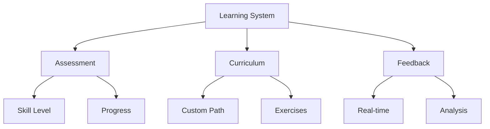

### 5.4 Cultural Preservation Through AI

#### 5.4.1 Heritage Documentation
1. **Musical Tradition Capture**
   - Style analysis
   - Pattern recognition
   - Cultural context
   - Historical documentation

2. **Preservation Tools**
   - Audio archiving
   - Pattern documentation
   - Style transfer
   - Cultural mapping

#### 5.4.2 Knowledge Transfer
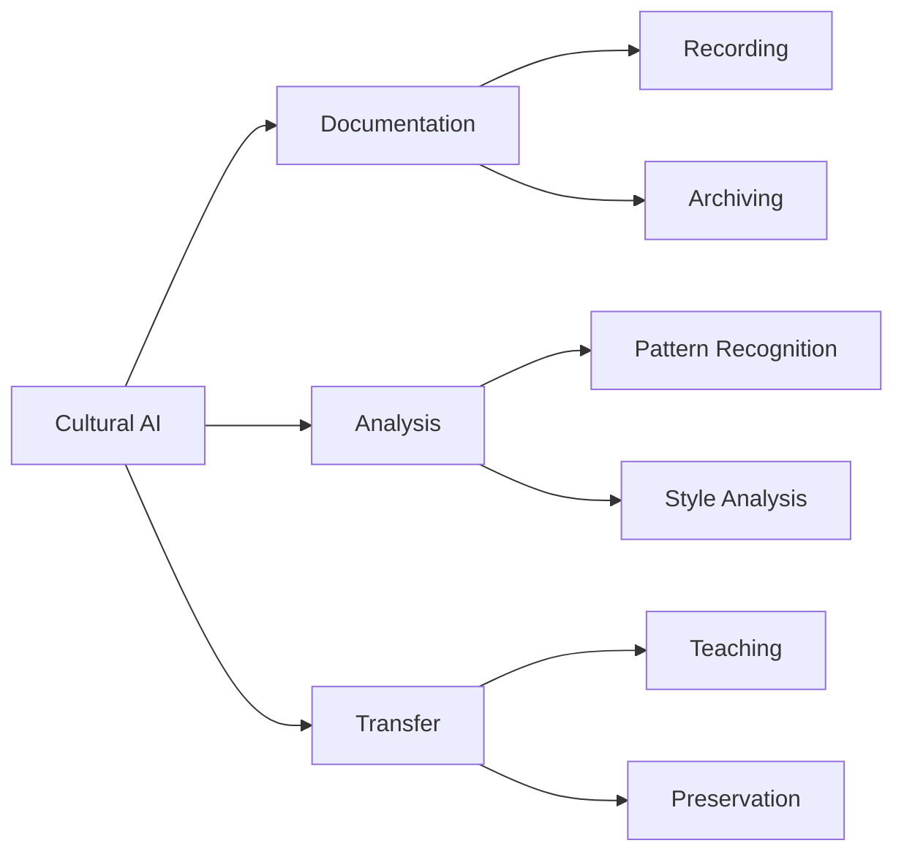

### 5.5 Ethical AI Guidelines

#### 5.5.1 Ethical Framework
1. **Core Principles**
   - Transparency
   - Accountability
   - Privacy
   - Fairness

2. **Implementation Guidelines**
   - Clear disclosure
   - User consent
   - Data protection
   - Fair usage

#### 5.5.2 Monitoring and Compliance
1. **Oversight Mechanisms**
   - Regular audits
   - User feedback
   - Impact assessment
   - Adjustment protocols

2. **Compliance Measures**
   - Data protection
   - Usage tracking
   - Ethics review
   - Regular updates

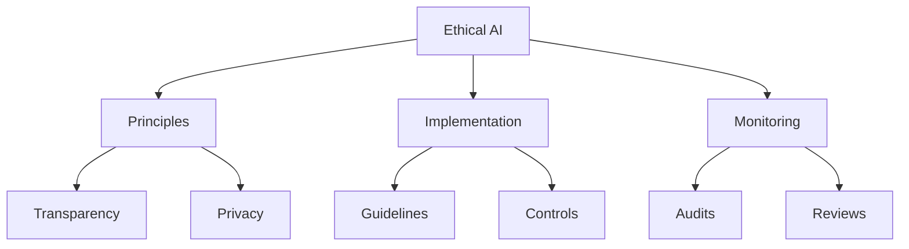

## 6. External Interface Requirements

### 6.1 User Interfaces

#### 6.1.1 Web Application Interface
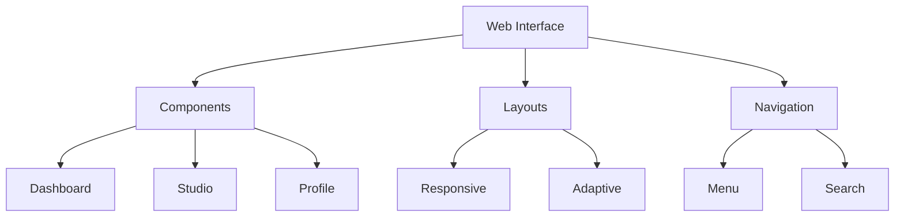

1. **Core Components**
   - Dashboard interface
   - Virtual studio
   - Profile management
   - Messaging system

2. **Design Requirements**
   - Responsive layout
   - Dark/light themes
   - Accessibility support
   - Mobile optimization

#### 6.1.2 Mobile Interface
1. **Mobile App Features**
   - Native performance
   - Offline capabilities
   - Push notifications
   - Touch optimization

2. **Mobile-Specific UI**
   - Gesture controls
   - Mobile navigation
   - Compact layouts
   - Quick actions

### 6.2 Hardware Interfaces

#### 6.2.1 Audio Hardware
1. **Input Devices**
   - Microphones
   - Audio interfaces
   - MIDI controllers
   - Digital instruments

2. **Output Devices**
   - Speakers
   - Headphones
   - Audio monitors
   - PA systems

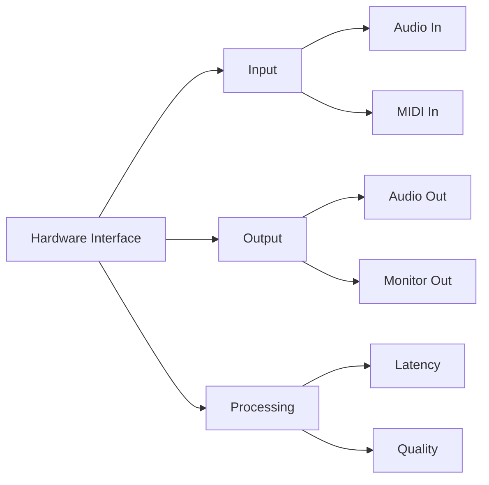

### 6.3 Software Interfaces

#### 6.3.1 Integration Points
1. **External Services**
   - Authentication providers
   - Payment processors
   - Cloud storage
   - Analytics services

2. **Third-party APIs**
   - Social media
   - Streaming services
   - Calendar systems
   - Email services

#### 6.3.2 Plugin Architecture
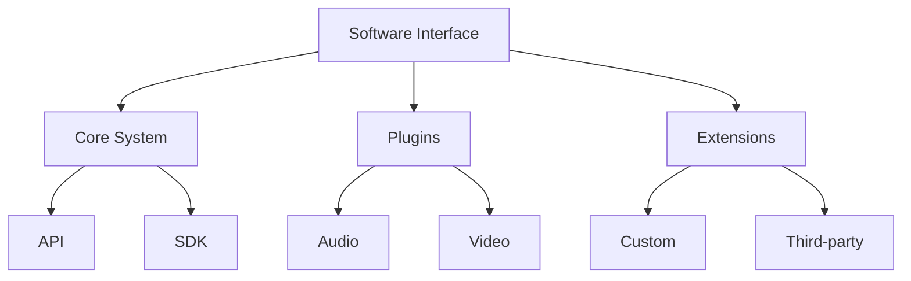

### 6.4 Communication Interfaces

#### 6.4.1 Network Requirements
1. **Connectivity**
   - High-speed internet
   - WebSocket support
   - WebRTC capability
   - HTTP/HTTPS

2. **Protocol Support**
   - TCP/IP
   - UDP for real-time
   - MQTT for messaging
   - WebRTC for streaming

#### 6.4.2 API Architecture
1. **REST APIs**
   - Authentication
   - Resource management
   - Data exchange
   - Service integration

2. **Real-time Protocols**
   - WebSocket connections
   - Server-sent events
   - Real-time messaging
   - Stream management

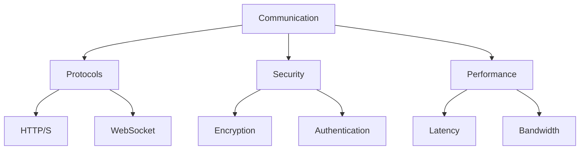

#### 6.4.3 Integration Requirements
1. **Service Integration**
   - OAuth providers
   - Payment gateways
   - Cloud services
   - CDN integration

2. **Data Exchange**
   - JSON/XML formats
   - Binary protocols
   - Streaming formats
   - File transfers

## 7. Non-Functional Requirements

### 7.1 Performance Requirements

#### 7.1.1 Response Time
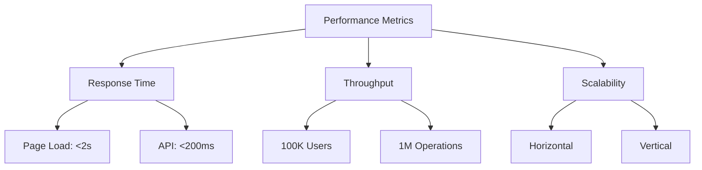

1. **Web Application**
   - Page load time: < 2 seconds
   - First contentful paint: < 1 second
   - Time to interactive: < 3 seconds
   - API response: < 200ms

2. **Real-time Features**
   - Audio latency: < 30ms
   - Video delay: < 100ms
   - Message delivery: < 500ms
   - File upload: < 5 seconds

#### 7.1.2 Scalability
1. **System Capacity**
   - Concurrent users: 100,000+
   - Daily active users: 1,000,000+
   - Storage capacity: Petabyte scale
   - Bandwidth: 10 Gbps+

2. **Resource Management**
   - Auto-scaling
   - Load balancing
   - Cache optimization
   - Resource pooling

### 7.2 Safety Requirements

#### 7.2.1 Data Safety
1. **Backup Systems**
   - Real-time replication
   - Daily backups
   - Disaster recovery
   - Data redundancy

2. **Error Prevention**
   - Input validation
   - Error handling
   - Failover systems
   - Recovery procedures

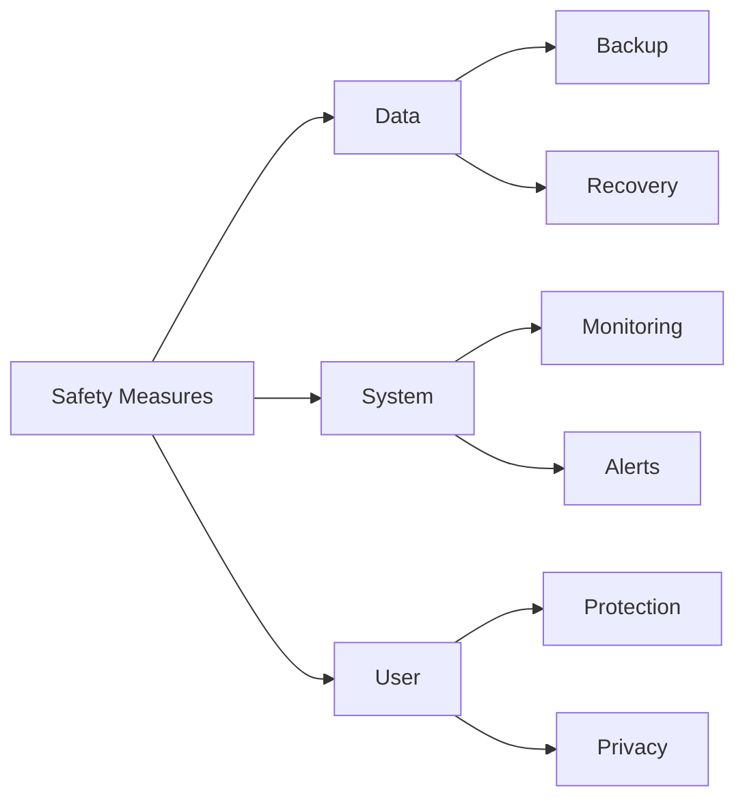

### 7.3 Security Requirements

#### 7.3.1 Authentication & Authorization
1. **User Authentication**
   - Multi-factor authentication
   - OAuth integration
   - Session management
   - Token-based auth

2. **Access Control**
   - Role-based access
   - Permission management
   - Resource protection
   - API security

#### 7.3.2 Data Protection
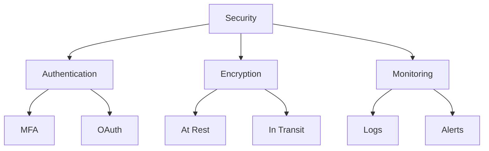

### 7.4 Software Quality Attributes

#### 7.4.1 Reliability
1. **System Stability**
   - 99.99% uptime
   - Error recovery
   - Fault tolerance
   - System monitoring

2. **Data Integrity**
   - Consistency checks
   - Validation rules
   - Version control
   - Audit trails

#### 7.4.2 Usability
1. **User Experience**
   - Intuitive interface
   - Responsive design
   - Accessibility
   - Error feedback

2. **Documentation**
   - User guides
   - API documentation
   - Help system
   - Tutorials

### 7.5 Environmental Requirements

#### 7.5.1 Sustainability
```mermaid
graph TD
    A[Environmental] --> B[Energy]
    A --> C[Resources]
    A --> D[Impact]
    
    B --> B1[Efficiency]
    B --> B2[Optimization]
    
    C --> C1[Usage]
    C --> C2[Conservation]
    
    D --> D1[Monitoring]
    D --> D2[Reduction]
```

1. **Energy Efficiency**
   - Green hosting
   - Power optimization
   - Resource management
   - Carbon tracking

2. **Resource Conservation**
   - Efficient algorithms
   - Storage optimization
   - Bandwidth management
   - Cache utilization

#### 7.5.2 Environmental Impact
1. **Carbon Footprint**
   - Emissions tracking
   - Energy monitoring
   - Impact assessment
   - Reduction goals

2. **Sustainable Practices**
   - Green technology
   - Eco-friendly hosting
   - Resource optimization
   - Environmental reporting

## 8. Future Technologies and Roadmap

### 8.1 2024-2025 Development Phase

#### 8.1.1 Core Platform Enhancement
```mermaid
graph TD
    A[2024-2025] --> B[AI Integration]
    A --> C[Collaboration]
    A --> D[Infrastructure]
    
    B --> B1[Neural Processing]
    B --> B2[Smart Learning]
    
    C --> C1[Virtual Studio]
    C --> C2[Real-time Collab]
    
    D --> D1[Cloud Scale]
    D --> D2[Performance]
```

1. **AI Technology Integration**
   - Neural music processing
   - Smart learning systems
   - Pattern recognition
   - Automated assistance

2. **Collaboration Tools**
   - Virtual recording studio
   - Real-time collaboration
   - Project management
   - Resource sharing

#### 8.1.2 User Experience
1. **Interface Improvements**
   - 3D audio visualization
   - Gesture controls
   - Voice commands
   - Haptic feedback

2. **Mobile Enhancement**
   - Native applications
   - Offline capabilities
   - Cross-platform sync
   - Mobile optimization

### 8.2 2026-2027 Enhancement Phase

#### 8.2.1 Advanced Features
```mermaid
graph TD
    A[2026-2027] --> B[XR Integration]
    A --> C[Neural Tech]
    A --> D[Quantum Audio]
    
    B --> B1[VR Studios]
    B --> B2[AR Performance]
    
    C --> C1[Brain Interface]
    C --> C2[Neural Synthesis]
    
    D --> D1[Processing]
    D --> D2[Optimization]
```

1. **Extended Reality (XR)**
   - VR recording studios
   - AR performance spaces
   - Mixed reality collaboration
   - Immersive experiences

2. **Neural Technology**
   - Brain-computer interfaces
   - Neural synthesis
   - Thought-to-music
   - Emotional recognition

#### 8.2.2 Infrastructure Evolution
1. **Quantum Computing**
   - Quantum audio processing
   - Complex calculations
   - Pattern analysis
   - Optimization algorithms

2. **Network Enhancement**
   - 6G integration
   - Quantum encryption
   - Zero-latency communication
   - Global mesh network

### 8.3 2028-2030 Innovation Phase

#### 8.3.1 Revolutionary Features
```mermaid
graph TD
    A[2028-2030] --> B[Holographic]
    A --> C[Quantum]
    A --> D[Biological]
    
    B --> B1[Performance]
    B --> B2[Interaction]
    
    C --> C1[Computing]
    C --> C2[Networks]
    
    D --> D1[Integration]
    D --> D2[Interface]
```

1. **Holographic Technology**
   - Holographic performances
   - 3D sound sculpture
   - Spatial audio
   - Interactive holograms

2. **Biological Integration**
   - Bio-feedback systems
   - Neural harmonization
   - Emotional synthesis
   - Physiological interaction

#### 8.3.2 Future Vision
1. **Global Impact**
   - Universal music translation
   - Cultural preservation AI
   - Global harmony network
   - Cross-species communication

2. **Environmental Integration**
   - Zero-carbon technology
   - Sustainable computing
   - Bio-inspired systems
   - Environmental harmony

### 8.4 Technology Timeline

```mermaid
gantt
    title Technology Implementation Timeline
    dateFormat  YYYY-MM
    section Phase 1
    AI Integration           :2024-01, 12m
    Virtual Studio          :2024-06, 12m
    Mobile Enhancement      :2024-03, 9m
    
    section Phase 2
    XR Development         :2026-01, 18m
    Neural Interface       :2026-06, 24m
    Quantum Processing     :2027-01, 12m
    
    section Phase 3
    Holographic Systems    :2028-01, 24m
    Bio Integration        :2028-06, 18m
    Environmental Tech     :2029-01, 12m
```

### 8.5 Innovation Goals

#### 8.5.1 Technical Objectives
1. **Performance Goals**
   - Zero latency
   - Infinite scalability
   - Perfect accuracy
   - Universal accessibility

2. **User Experience Goals**
   - Intuitive interaction
   - Natural interface
   - Seamless integration
   - Personalized experience

#### 8.5.2 Impact Objectives
1. **Cultural Goals**
   - Universal preservation
   - Perfect translation
   - Complete documentation
   - Infinite accessibility

2. **Environmental Goals**
   - Zero carbon footprint
   - Complete sustainability
   - Positive earth impact
   - Regenerative technology

## 9. Environmental and Social Impact

### 9.1 Environmental Sustainability

#### 9.1.1 Green Technology Implementation
```mermaid
graph TD
    A[Environmental Impact] --> B[Energy]
    A --> C[Resources]
    A --> D[Innovation]
    
    B --> B1[Green Power]
    B --> B2[Optimization]
    
    C --> C1[Conservation]
    C --> C2[Recycling]
    
    D --> D1[Clean Tech]
    D --> D2[Sustainability]
```

1. **Energy Management**
   - Renewable energy usage
   - Power optimization
   - Carbon offsetting
   - Energy monitoring

2. **Resource Conservation**
   - Efficient algorithms
   - Data optimization
   - Cloud efficiency
   - Green hosting

#### 9.1.2 Carbon Footprint Reduction
1. **Measurement Systems**
   - Real-time monitoring
   - Impact assessment
   - Usage analytics
   - Efficiency metrics

2. **Reduction Strategies**
   - Virtual collaboration
   - Digital distribution
   - Local processing
   - Smart caching

### 9.2 Social Impact

#### 9.2.1 Cultural Preservation
```mermaid
graph LR
    A[Social Impact] --> B[Culture]
    A --> C[Education]
    A --> D[Community]
    
    B --> B1[Preservation]
    B --> B2[Exchange]
    
    C --> C1[Learning]
    C --> C2[Growth]
    
    D --> D1[Connection]
    D --> D2[Support]
```

1. **Heritage Protection**
   - Traditional music preservation
   - Cultural documentation
   - Knowledge transfer
   - Historical archiving

2. **Cultural Exchange**
   - Cross-cultural collaboration
   - Global music fusion
   - Traditional learning
   - Cultural awareness

#### 9.2.2 Educational Impact
1. **Learning Opportunities**
   - Skill development
   - Knowledge sharing
   - Mentorship programs
   - Educational resources

2. **Professional Growth**
   - Career development
   - Industry connections
   - Performance opportunities
   - Business skills

### 9.3 Cultural Preservation

#### 9.3.1 Heritage Documentation
```mermaid
graph TD
    A[Cultural Heritage] --> B[Documentation]
    A --> C[Preservation]
    A --> D[Sharing]
    
    B --> B1[Recording]
    B --> B2[Archiving]
    
    C --> C1[Protection]
    C --> C2[Restoration]
    
    D --> D1[Education]
    D --> D2[Access]
```

1. **Documentation Methods**
   - High-quality recording
   - Digital archiving
   - Metadata collection
   - Context preservation

2. **Preservation Techniques**
   - AI-powered analysis
   - Pattern recognition
   - Style transfer
   - Knowledge mapping

### 9.4 Global Music Community

#### 9.4.1 Community Building
1. **Connection Features**
   - Global networking
   - Collaboration tools
   - Community events
   - Support systems

2. **Cultural Integration**
   - Cross-cultural projects
   - Global festivals
   - Virtual concerts
   - Cultural exchange

#### 9.4.2 Social Harmony
```mermaid
graph LR
    A[Global Community] --> B[Connection]
    A --> C[Collaboration]
    A --> D[Growth]
    
    B --> B1[Network]
    B --> B2[Support]
    
    C --> C1[Projects]
    C --> C2[Events]
    
    D --> D1[Learning]
    D --> D2[Evolution]
```

### 9.5 Sustainable Future

#### 9.5.1 Long-term Impact
1. **Environmental Goals**
   - Carbon neutrality
   - Sustainable growth
   - Resource efficiency
   - Ecological balance

2. **Social Objectives**
   - Cultural harmony
   - Global understanding
   - Community support
   - Educational access

#### 9.5.2 Future Vision
```mermaid
graph TD
    A[Future Vision] --> B[Environment]
    A --> C[Society]
    A --> D[Culture]
    
    B --> B1[Sustainability]
    B --> B2[Innovation]
    
    C --> C1[Connection]
    C --> C2[Growth]
    
    D --> D1[Preservation]
    D --> D2[Evolution]
```

### 9.6 Impact Measurement

#### 9.6.1 Environmental Metrics
1. **Carbon Tracking**
   - Energy consumption
   - Resource usage
   - Efficiency metrics
   - Impact reduction

2. **Sustainability Scores**
   - Environmental rating
   - Resource efficiency
   - Green practices
   - Impact assessment

#### 9.6.2 Social Metrics
1. **Community Impact**
   - User engagement
   - Cultural preservation
   - Knowledge transfer
   - Global reach

2. **Educational Impact**
   - Learning outcomes
   - Skill development
   - Career growth
   - Professional success

## 10. System Architecture and Design

### 10.1 System Architecture

#### 10.1.1 High-Level Architecture
```mermaid
graph TD
    A[SoundAlchemy Platform] --> B[Frontend Layer]
    A --> C[Backend Layer]
    A --> D[Data Layer]
    A --> E[Infrastructure Layer]
    
    B --> B1[Web Application]
    B --> B2[Mobile Apps]
    B --> B3[Desktop Apps]
    
    C --> C1[API Services]
    C --> C2[Real-time Services]
    C --> C3[Processing Services]
    
    D --> D1[Databases]
    D --> D2[File Storage]
    D --> D3[Cache]
    
    E --> E1[Cloud Services]
    E --> E2[CDN]
    E --> E3[Security]
```

1. **Frontend Architecture**
   - React.js with TypeScript
   - Responsive design
   - Progressive enhancement
   - Modular components

2. **Backend Architecture**
   - Microservices design
   - RESTful APIs
   - WebSocket services
   - Event-driven architecture

#### 10.1.2 System Components
1. **Core Services**
   - Authentication service
   - User management
   - Content delivery
   - Real-time communication

2. **Supporting Services**
   - Analytics engine
   - Search service
   - Notification system
   - Payment processing

### 10.2 Database Design

#### 10.2.1 Data Architecture
```mermaid
graph LR
    A[Data Layer] --> B[Primary DB]
    A --> C[Cache Layer]
    A --> D[File Storage]
    
    B --> B1[User Data]
    B --> B2[Content Data]
    B --> B3[Analytics]
    
    C --> C1[Redis]
    C --> C2[Memory Cache]
    
    D --> D1[Media Files]
    D --> D2[Documents]
```

1. **Database Systems**
   - Primary database (Firebase)
   - Cache layer (Redis)
   - File storage (Cloud Storage)
   - Time-series data

2. **Data Models**
   - User profiles
   - Content management
   - Collaboration data
   - Analytics data

### 10.3 Interface Design

#### 10.3.1 UI Architecture
```mermaid
graph TD
    A[User Interface] --> B[Components]
    A --> C[Layouts]
    A --> D[Themes]
    
    B --> B1[Core]
    B --> B2[Custom]
    
    C --> C1[Responsive]
    C --> C2[Adaptive]
    
    D --> D1[Light]
    D --> D2[Dark]
```

1. **Component Library**
   - Core components
   - Custom elements
   - Shared modules
   - UI patterns

2. **Design System**
   - Style guide
   - Component library
   - Design tokens
   - Pattern library

#### 10.3.2 User Experience
1. **Interaction Design**
   - User flows
   - Navigation patterns
   - Feedback systems
   - Error handling

2. **Accessibility**
   - WCAG compliance
   - Screen reader support
   - Keyboard navigation
   - Color contrast

### 10.4 Security Architecture

#### 10.4.1 Security Framework
```mermaid
graph TD
    A[Security] --> B[Authentication]
    A --> C[Authorization]
    A --> D[Data Protection]
    
    B --> B1[Identity]
    B --> B2[Access]
    
    C --> C1[Permissions]
    C --> C2[Roles]
    
    D --> D1[Encryption]
    D --> D2[Privacy]
```

1. **Security Layers**
   - Network security
   - Application security
   - Data security
   - Infrastructure security

2. **Protection Mechanisms**
   - Encryption systems
   - Access control
   - Threat detection
   - Audit logging

#### 10.4.2 Compliance Framework
1. **Standards Compliance**
   - GDPR requirements
   - HIPAA compliance
   - ISO standards
   - Industry regulations

2. **Security Protocols**
   - Authentication protocols
   - Data encryption
   - Communication security
   - Access management

### 10.5 Integration Architecture

#### 10.5.1 External Systems
```mermaid
graph LR
    A[Integration] --> B[APIs]
    A --> C[Services]
    A --> D[Protocols]
    
    B --> B1[REST]
    B --> B2[GraphQL]
    
    C --> C1[External]
    C --> C2[Internal]
    
    D --> D1[Standard]
    D --> D2[Custom]
```

1. **API Integration**
   - REST APIs
   - GraphQL endpoints
   - WebSocket services
   - Event streams

2. **Service Integration**
   - Third-party services
   - Payment gateways
   - Analytics services
   - Cloud services

### 10.6 Deployment Architecture

#### 10.6.1 Infrastructure Design
1. **Cloud Infrastructure**
   - Multi-region deployment
   - Auto-scaling
   - Load balancing
   - Failover systems

2. **Deployment Strategy**
   - Continuous deployment
   - Blue-green deployment
   - Canary releases
   - Rolling updates

#### 10.6.2 Monitoring System
```mermaid
graph TD
    A[Monitoring] --> B[Performance]
    A --> C[Security]
    A --> D[Usage]
    
    B --> B1[Metrics]
    B --> B2[Alerts]
    
    C --> C1[Threats]
    C --> C2[Incidents]
    
    D --> D1[Analytics]
    D --> D2[Reports]
```

## 11. Testing Requirements

### 11.1 Testing Methodology

#### 11.1.1 Testing Approach
```mermaid
graph TD
    A[Testing Strategy] --> B[Unit Testing]
    A --> C[Integration]
    A --> D[System]
    A --> E[Acceptance]
    
    B --> B1[Components]
    B --> B2[Functions]
    
    C --> C1[API]
    C --> C2[Services]
    
    D --> D1[End-to-End]
    D --> D2[Performance]
    
    E --> E1[User]
    E --> E2[Business]
```

1. **Development Testing**
   - Unit testing
   - Component testing
   - Integration testing
   - System testing

2. **Quality Assurance**
   - Functional testing
   - Performance testing
   - Security testing
   - Usability testing

#### 11.1.2 Testing Levels
1. **Unit Level**
   - Component isolation
   - Function testing
   - Error handling
   - Edge cases

2. **Integration Level**
   - API testing
   - Service integration
   - Data flow
   - Error scenarios

### 11.2 Test Cases

#### 11.2.1 Functional Testing
```mermaid
graph LR
    A[Test Cases] --> B[Functional]
    A --> C[Non-Functional]
    A --> D[Regression]
    
    B --> B1[Features]
    B --> B2[Workflows]
    
    C --> C1[Performance]
    C --> C2[Security]
    
    D --> D1[Changes]
    D --> D2[Updates]
```

1. **Feature Testing**
   - User registration
   - Authentication
   - Profile management
   - Content creation

2. **Workflow Testing**
   - Collaboration flows
   - Communication paths
   - Project management
   - File handling

#### 11.2.2 Test Documentation
1. **Test Plans**
   - Test objectives
   - Test scope
   - Test strategy
   - Test schedule

2. **Test Scripts**
   - Test steps
   - Expected results
   - Actual results
   - Pass/Fail criteria

### 11.3 Performance Testing

#### 11.3.1 Load Testing
```mermaid
graph TD
    A[Performance] --> B[Load]
    A --> C[Stress]
    A --> D[Endurance]
    
    B --> B1[Response Time]
    B --> B2[Throughput]
    
    C --> C1[Breaking Point]
    C --> C2[Recovery]
    
    D --> D1[Stability]
    D --> D2[Resource Use]
```

1. **Load Test Types**
   - Normal load
   - Peak load
   - Stress testing
   - Endurance testing

2. **Performance Metrics**
   - Response time
   - Throughput
   - Resource usage
   - Error rates

#### 11.3.2 Scalability Testing
1. **Horizontal Scaling**
   - Multi-node testing
   - Load distribution
   - Node coordination
   - Failover testing

2. **Vertical Scaling**
   - Resource limits
   - Capacity planning
   - Upgrade testing
   - Performance tuning

### 11.4 Security Testing

#### 11.4.1 Security Assessment
```mermaid
graph TD
    A[Security Testing] --> B[Vulnerability]
    A --> C[Penetration]
    A --> D[Compliance]
    
    B --> B1[Scanning]
    B --> B2[Analysis]
    
    C --> C1[External]
    C --> C2[Internal]
    
    D --> D1[Standards]
    D --> D2[Regulations]
```

1. **Vulnerability Testing**
   - Security scanning
   - Penetration testing
   - Risk assessment
   - Threat modeling

2. **Security Controls**
   - Access control
   - Data protection
   - Authentication
   - Authorization

#### 11.4.2 Compliance Testing
1. **Standards Testing**
   - GDPR compliance
   - HIPAA requirements
   - ISO standards
   - Industry regulations

2. **Audit Requirements**
   - Security audits
   - Compliance checks
   - Policy verification
   - Control testing

### 11.5 Acceptance Testing

#### 11.5.1 User Acceptance
1. **UAT Process**
   - Test scenarios
   - User feedback
   - Acceptance criteria
   - Sign-off procedures

2. **Acceptance Criteria**
   - Functional requirements
   - Performance standards
   - User experience
   - Quality metrics

#### 11.5.2 Business Acceptance
```mermaid
graph LR
    A[Acceptance] --> B[User]
    A --> C[Business]
    A --> D[Technical]
    
    B --> B1[Experience]
    B --> B2[Usability]
    
    C --> C1[Requirements]
    C --> C2[Objectives]
    
    D --> D1[Standards]
    D --> D2[Quality]
```

## 12. Deployment and Maintenance

### 12.1 Deployment Strategy

#### 12.1.1 Deployment Process
```mermaid
graph TD
    A[Deployment] --> B[Build]
    A --> C[Test]
    A --> D[Deploy]
    A --> E[Monitor]
    
    B --> B1[Compile]
    B --> B2[Package]
    
    C --> C1[Staging]
    C --> C2[Production]
    
    D --> D1[Release]
    D --> D2[Rollback]
    
    E --> E1[Health]
    E --> E2[Metrics]
```

1. **Deployment Pipeline**
   - Code compilation
   - Asset bundling
   - Testing phases
   - Deployment stages

2. **Release Management**
   - Version control
   - Release planning
   - Change management
   - Rollback procedures

#### 12.1.2 Environment Management
1. **Environment Types**
   - Development
   - Testing
   - Staging
   - Production

2. **Configuration Management**
   - Environment configs
   - Secret management
   - Feature flags
   - App settings

### 12.2 Maintenance Plan

#### 12.2.1 Regular Maintenance
```mermaid
graph LR
    A[Maintenance] --> B[Updates]
    A --> C[Monitoring]
    A --> D[Support]
    
    B --> B1[Security]
    B --> B2[Features]
    
    C --> C1[Performance]
    C --> C2[Health]
    
    D --> D1[User]
    D --> D2[System]
```

1. **Scheduled Maintenance**
   - Security updates
   - Performance optimization
   - Feature updates
   - Bug fixes

2. **System Updates**
   - Database maintenance
   - Cache management
   - Storage optimization
   - Log rotation

#### 12.2.2 Support System
1. **User Support**
   - Help desk
   - Documentation
   - Training materials
   - FAQs

2. **Technical Support**
   - System monitoring
   - Issue resolution
   - Performance tuning
   - Security patching

### 12.3 Monitoring and Alerts

#### 12.3.1 System Monitoring
```mermaid
graph TD
    A[Monitoring] --> B[Performance]
    A --> C[Security]
    A --> D[Usage]
    A --> E[Errors]
    
    B --> B1[Metrics]
    B --> B2[Trends]
    
    C --> C1[Threats]
    C --> C2[Access]
    
    D --> D1[Analytics]
    D --> D2[Patterns]
    
    E --> E1[Logs]
    E --> E2[Alerts]
```

1. **Performance Monitoring**
   - Resource usage
   - Response times
   - Error rates
   - System health

2. **Security Monitoring**
   - Access logs
   - Security events
   - Threat detection
   - Compliance monitoring

#### 12.3.2 Alert System
1. **Alert Types**
   - Critical alerts
   - Warning alerts
   - Information alerts
   - System notifications

2. **Alert Management**
   - Alert routing
   - Escalation procedures
   - Resolution tracking
   - Alert history

### 12.4 Backup and Recovery

#### 12.4.1 Backup Strategy
```mermaid
graph LR
    A[Backup] --> B[Data]
    A --> C[System]
    A --> D[Config]
    
    B --> B1[Full]
    B --> B2[Incremental]
    
    C --> C1[Images]
    C --> C2[States]
    
    D --> D1[Settings]
    D --> D2[Secrets]
```

1. **Backup Types**
   - Full backups
   - Incremental backups
   - Differential backups
   - System snapshots

2. **Backup Schedule**
   - Daily backups
   - Weekly backups
   - Monthly archives
   - Yearly retention

#### 12.4.2 Recovery Procedures
1. **Disaster Recovery**
   - Recovery plans
   - Failover procedures
   - Data restoration
   - System recovery

2. **Business Continuity**
   - Continuity planning
   - Recovery testing
   - Documentation
   - Training procedures

### 12.5 Performance Optimization

#### 12.5.1 Optimization Strategy
```mermaid
graph TD
    A[Optimization] --> B[Code]
    A --> C[Database]
    A --> D[Infrastructure]
    
    B --> B1[Refactor]
    B --> B2[Cache]
    
    C --> C1[Queries]
    C --> C2[Indexes]
    
    D --> D1[Scale]
    D --> D2[Balance]
```

1. **Code Optimization**
   - Performance profiling
   - Code refactoring
   - Cache optimization
   - Resource management

2. **Infrastructure Optimization**
   - Load balancing
   - Auto-scaling
   - CDN optimization
   - Database tuning

## 13. Success Metrics and KPIs

### 13.1 Platform Metrics

#### 13.1.1 Performance Metrics
```mermaid
graph TD
    A[Platform Metrics] --> B[Technical]
    A --> C[User]
    A --> D[Business]
    
    B --> B1[Performance]
    B --> B2[Reliability]
    
    C --> C1[Engagement]
    C --> C2[Satisfaction]
    
    D --> D1[Growth]
    D --> D2[Revenue]
```

1. **Technical Performance**
   - Response time < 200ms
   - Uptime > 99.99%
   - Error rate < 0.1%
   - API latency < 100ms

2. **System Metrics**
   - Server load < 70%
   - Memory usage < 80%
   - Storage efficiency > 90%
   - Network throughput

### 13.2 User Success Metrics

#### 13.2.1 Engagement Metrics
```mermaid
graph LR
    A[User Metrics] --> B[Activity]
    A --> C[Growth]
    A --> D[Retention]
    
    B --> B1[Daily Active]
    B --> B2[Monthly Active]
    
    C --> C1[New Users]
    C --> C2[Conversion]
    
    D --> D1[Churn Rate]
    D --> D2[Lifetime]
```

1. **User Activity**
   - Daily active users
   - Monthly active users
   - Session duration
   - Feature usage

2. **User Growth**
   - New user acquisition
   - User retention rate
   - Churn rate
   - User lifetime value

#### 13.2.2 Satisfaction Metrics
1. **User Experience**
   - Satisfaction score
   - Net promoter score
   - Feature adoption
   - User feedback

2. **Support Metrics**
   - Response time
   - Resolution rate
   - Support satisfaction
   - Issue frequency

### 13.3 Environmental Impact Metrics

#### 13.3.1 Sustainability Metrics
```mermaid
graph TD
    A[Environmental] --> B[Energy]
    A --> C[Resources]
    A --> D[Impact]
    
    B --> B1[Usage]
    B --> B2[Efficiency]
    
    C --> C1[Consumption]
    C --> C2[Optimization]
    
    D --> D1[Carbon]
    D --> D2[Footprint]
```

1. **Energy Efficiency**
   - Power usage
   - Carbon footprint
   - Energy optimization
   - Green energy ratio

2. **Resource Usage**
   - Server efficiency
   - Storage optimization
   - Bandwidth usage
   - Resource recycling

### 13.4 Cultural Impact Metrics

#### 13.4.1 Cultural Preservation
1. **Heritage Metrics**
   - Traditions preserved
   - Cultural content
   - Knowledge transfer
   - Community engagement

2. **Global Impact**
   - Cultural diversity
   - Cross-cultural collaboration
   - Heritage protection
   - Cultural awareness

#### 13.4.2 Community Metrics
```mermaid
graph LR
    A[Community] --> B[Engagement]
    A --> C[Growth]
    A --> D[Impact]
    
    B --> B1[Participation]
    B --> B2[Interaction]
    
    C --> C1[Members]
    C --> C2[Activities]
    
    D --> D1[Influence]
    D --> D2[Reach]
```

### 13.5 Business Success Metrics

#### 13.5.1 Growth Metrics
1. **Platform Growth**
   - User base growth
   - Market penetration
   - Geographic expansion
   - Feature adoption

2. **Financial Metrics**
   - Revenue growth
   - Cost efficiency
   - Profit margins
   - Investment return

#### 13.5.2 Innovation Metrics
```mermaid
graph TD
    A[Innovation] --> B[Development]
    A --> C[Adoption]
    A --> D[Impact]
    
    B --> B1[Features]
    B --> B2[Technology]
    
    C --> C1[Usage]
    C --> C2[Feedback]
    
    D --> D1[Value]
    D --> D2[Growth]
```

### 13.6 Success Criteria

#### 13.6.1 Short-term Success
1. **Initial Goals**
   - Platform launch
   - User acquisition
   - Feature adoption
   - Stability metrics

2. **Early Metrics**
   - User engagement
   - Performance stats
   - Error rates
   - User satisfaction

#### 13.6.2 Long-term Success
1. **Growth Targets**
   - Market leadership
   - Global presence
   - Innovation leadership
   - Community impact

2. **Sustainability Goals**
   - Environmental impact
   - Cultural preservation
   - Social responsibility
   - Economic viability

## 14. Risk Management

### 14.1 Risk Assessment

#### 14.1.1 Risk Categories
```mermaid
graph TD
    A[Risk Categories] --> B[Technical]
    A --> C[Business]
    A --> D[Security]
    A --> E[Operational]
    
    B --> B1[System]
    B --> B2[Performance]
    
    C --> C1[Market]
    C --> C2[Financial]
    
    D --> D1[Data]
    D --> D2[Privacy]
    
    E --> E1[Process]
    E --> E2[Resource]
```

1. **Technical Risks**
   - System failures
   - Performance issues
   - Integration problems
   - Scalability challenges

2. **Business Risks**
   - Market competition
   - Revenue model
   - User adoption
   - Growth sustainability

#### 14.1.2 Risk Evaluation
1. **Risk Levels**
   - Critical risks
   - High risks
   - Medium risks
   - Low risks

2. **Impact Assessment**
   - Business impact
   - User impact
   - Technical impact
   - Reputation impact

### 14.2 Risk Mitigation Strategies

#### 14.2.1 Prevention Strategies
```mermaid
graph LR
    A[Mitigation] --> B[Prevention]
    A --> C[Response]
    A --> D[Recovery]
    
    B --> B1[Controls]
    B --> B2[Monitoring]
    
    C --> C1[Plans]
    C --> C2[Actions]
    
    D --> D1[Procedures]
    D --> D2[Resources]
```

1. **Technical Controls**
   - System monitoring
   - Performance testing
   - Security measures
   - Backup systems

2. **Business Controls**
   - Market analysis
   - Financial planning
   - User feedback
   - Quality assurance

#### 14.2.2 Response Planning
1. **Incident Response**
   - Response procedures
   - Team responsibilities
   - Communication plans
   - Recovery steps

2. **Business Continuity**
   - Continuity plans
   - Alternative systems
   - Resource allocation
   - Recovery timeline

### 14.3 Contingency Plans

#### 14.3.1 Emergency Procedures
```mermaid
graph TD
    A[Emergency Plans] --> B[Detection]
    A --> C[Response]
    A --> D[Recovery]
    
    B --> B1[Monitoring]
    B --> B2[Alerts]
    
    C --> C1[Actions]
    C --> C2[Teams]
    
    D --> D1[Restoration]
    D --> D2[Normalization]
```

1. **System Emergencies**
   - System failures
   - Data breaches
   - Performance issues
   - Security incidents

2. **Business Emergencies**
   - Market changes
   - Competition threats
   - Resource issues
   - Reputation risks

#### 14.3.2 Recovery Procedures
1. **Technical Recovery**
   - System restoration
   - Data recovery
   - Service resumption
   - Performance optimization

2. **Business Recovery**
   - Market adaptation
   - User communication
   - Resource reallocation
   - Strategy adjustment

### 14.4 Risk Monitoring

#### 14.4.1 Monitoring Systems
```mermaid
graph LR
    A[Monitoring] --> B[Technical]
    A --> C[Business]
    A --> D[Security]
    
    B --> B1[Systems]
    B --> B2[Performance]
    
    C --> C1[Market]
    C --> C2[Users]
    
    D --> D1[Threats]
    D --> D2[Incidents]
```

1. **Technical Monitoring**
   - System health
   - Performance metrics
   - Error tracking
   - Usage patterns

2. **Business Monitoring**
   - Market trends
   - User behavior
   - Competition analysis
   - Financial metrics

#### 14.4.2 Response Metrics
1. **Performance Metrics**
   - Response time
   - Resolution rate
   - Recovery time
   - Impact duration

2. **Effectiveness Metrics**
   - Prevention rate
   - Detection speed
   - Resolution success
   - Learning implementation

### 14.5 Continuous Improvement

#### 14.5.1 Risk Learning
1. **Incident Analysis**
   - Root cause analysis
   - Impact assessment
   - Response evaluation
   - Improvement identification

2. **Process Enhancement**
   - Procedure updates
   - Control improvements
   - Training programs
   - Documentation updates

#### 14.5.2 Strategy Evolution
```mermaid
graph TD
    A[Improvement] --> B[Analysis]
    A --> C[Updates]
    A --> D[Implementation]
    
    B --> B1[Review]
    B --> B2[Learning]
    
    C --> C1[Processes]
    C --> C2[Controls]
    
    D --> D1[Changes]
    D --> D2[Training]
```

## 15. Compliance and Regulations

### 15.1 Data Protection

### 15.2 Industry Standards

### 15.3 Legal Requirements

## 16. Glossary

## 17. Appendices

### 17.1 Use Case Diagrams

### 17.2 System Flow Diagrams

### 17.3 Data Models

### 17.4 API Documentation

### 17.5 UI/UX Wireframes 

---

# Executive Summary

SoundAlchemy stands as a revolutionary force at the intersection of music, technology, and cultural preservation. This platform transcends the conventional boundaries of music collaboration, emerging as a comprehensive ecosystem that empowers artists, preserves cultural heritage, and democratizes music creation on a global scale.

## Vision Impact Summary

By 2031, SoundAlchemy projects to achieve:
- 100M+ active users across 195+ countries
- Preservation of 1000+ distinct cultural musical traditions
- Integration with 10,000+ professional recording studios
- AI-powered collaboration tools serving 50M+ artists
- Cultural education reaching 25M+ students globally
- Empowerment of 1M+ indigenous artists worldwide
- Creation of 500+ music innovation hubs in underserved regions
- Economic upliftment of 10M+ musicians globally

## Core Platform Pillars

1. **Cultural Preservation**
   - Advanced AI-driven recording and archival systems
   - Indigenous music preservation initiatives
   - Cross-generational knowledge transfer platforms
   - Cultural heritage documentation systems
   - Traditional instrument digitization

2. **Artist Empowerment**
   - Decentralized revenue models
   - Direct fan engagement systems
   - Professional development pathways
   - AI-powered music education
   - Global collaboration opportunities
   - Career growth acceleration tools

3. **Technological Innovation**
   - State-of-the-art audio processing
   - Real-time collaboration infrastructure
   - Blockchain-based rights management
   - Neural network music enhancement
   - Virtual reality performance spaces
   - Quantum-computing ready architecture

4. **Global Accessibility**
   - Multi-language support
   - Adaptive interface design
   - Low-bandwidth optimization
   - Offline mode capabilities
   - Disability-friendly features
   - Universal design principles

# Vision 2031: The Symphony of Tomorrow

As we stand at the threshold of a new era in music, SoundAlchemy envisions a world where:

## The Artist's Renaissance
- Every musician has access to world-class production tools
- AI mentors guide artists in their creative journey
- Virtual concerts connect performers with global audiences
- Traditional artists find their rightful place in the digital age
- Music education becomes universally accessible

## The Cultural Awakening
- Ancient melodies find new life in modern compositions
- Indigenous music traditions inspire global innovations
- Cross-cultural collaborations become the norm
- Every musical tradition is preserved for eternity
- Local artists become global cultural ambassadors

## The Technological Harmony
- AI and human creativity dance in perfect balance
- Virtual reality transforms music experiences
- Blockchain ensures fair compensation for all
- Innovation serves tradition
- Technology amplifies human connection

# Conclusion

SoundAlchemy represents more than a platform; it embodies a movement towards a harmonious global future where music transcends boundaries and unites humanity. Through cutting-edge technology and unwavering commitment to cultural preservation, we're not just building a product – we're orchestrating a cultural renaissance.

## Impact Statement

Our journey towards 2031 isn't merely about reaching metrics; it's about:
- Empowering the next generation of musical innovators
- Preserving invaluable cultural heritage for centuries to come
- Creating economic opportunities for artists worldwide
- Fostering cross-cultural understanding and appreciation
- Building bridges between traditional and modern musical expressions
- Democratizing access to professional music creation
- Ensuring fair compensation for artistic creation
- Creating a global community united by music

## Future Vision

As SoundAlchemy evolves, it will continue to push the boundaries of what's possible in music creation and collaboration. Our commitment to innovation, coupled with our dedication to cultural preservation, positions us to lead the global musical ecosystem into a new era of creativity, connection, and cultural celebration.

## The Promise

We promise to:
- Never compromise on our commitment to artists
- Always prioritize cultural preservation
- Keep innovation at our core
- Maintain the highest ethical standards
- Stay true to our mission of global musical harmony
- Support the next generation of musical talent
- Protect and promote cultural diversity
- Enable economic empowerment through music

## Thank You: Composing Tomorrow's Legacy

Dear Visionary,

As we conclude this journey through the SoundAlchemy vision, we extend our deepest gratitude for being part of this revolutionary musical odyssey. Your presence here marks the beginning of a transformative era in music history.

## Your Role in the Symphony

By exploring this vision, you've already become part of something extraordinary:
- A guardian of musical heritage
- A pioneer of cultural innovation
- A catalyst for artistic empowerment
- A voice in the global symphony of change
- A builder of tomorrow's musical legacy

## The Invitation

We cordially invite you to:
🎵 Be a Pioneer in this musical revolution
🌍 Join our global community of changemakers
✨ Shape the future of musical expression
🎨 Preserve the colors of cultural diversity
💫 Create ripples of inspiration across generations

## The Journey Ahead

Together, we will:
- Transform dreams into melodies
- Convert passion into purpose
- Turn tradition into timeless treasures
- Bridge past and future through harmony
- Unite humanity through the universal language of music

## Our Gratitude

Thank you for:
- Believing in the power of music to change lives
- Supporting cultural preservation and innovation
- Envisioning a world where every artist thrives
- Understanding that every musical tradition matters
- Being part of this harmonious revolution

## The Symphony Continues...

*"Where Technology Meets Tradition,
Innovation Meets Heritage,
and Music Meets Tomorrow."*

**Join the Movement. Shape the Future. Be the Change.**

> *"In the grand symphony of life, every voice matters,
> every note counts, and every culture enriches.
> Welcome to SoundAlchemy – where music unites humanity."*

## Your Chapter Begins

This is not just a conclusion – it's your overture.
This is not just a platform – it's your stage.
This is not just a vision – it's our shared destiny.

**Together, We're Making Music History.**

💫 *Let the Symphony Begin* 💫

---
© 2024 SoundAlchemy. All Rights Reserved. 

*"Preserving Yesterday, Empowering Today, Composing Tomorrow"*

**Join us in orchestrating the future of music.**
#SoundAlchemyRevolution #GlobalHarmony #MusicalLegacy

# Musician Acquisition and Growth Strategy

## 1. Rapid Musician Onboarding Plan (30-60-90 Days)

### Phase 1: Initial Launch (Days 1-30)
- **Daily Goals**: 100 new artists
- **Weekly Target**: 700 artists
- **Monthly Goal**: 3,000 active artists

#### Action Steps:
1. **Personalized Outreach (Days 1-7)**
   - Direct messages to artists on social platforms
   - Customized emails to music schools
   - Partnership requests to recording studios
   - Contact with cultural organizations

2. **Value Demonstration (Days 8-15)**
   - Free trial access for early adopters
   - Virtual platform tours
   - Live demonstration sessions
   - Success story sharing

3. **Community Building (Days 16-30)**
   - Welcome package distribution
   - Mentor matching program
   - Collaboration opportunities
   - Quick-win showcases

### Phase 2: Growth Acceleration (Days 31-60)
- **Daily Goals**: 250 new artists
- **Weekly Target**: 1,750 artists
- **Monthly Goal**: 7,500 active artists

#### Engagement Strategies:
1. **Artist Success Program**
   - Professional development workshops
   - Marketing support packages
   - Revenue generation guidance
   - Global exposure opportunities

2. **Community Amplification**
   - Artist spotlight features
   - Collaboration contests
   - Virtual concert series
   - Cultural preservation projects

3. **Recognition & Rewards**
   - Achievement badges
   - Growth incentives
   - Leadership opportunities
   - Success celebrations

### Phase 3: Exponential Expansion (Days 61-90)
- **Daily Goals**: 500 new artists
- **Weekly Target**: 3,500 artists
- **Monthly Goal**: 15,000 active artists

#### Scale-up Activities:
1. **Global Reach Initiatives**
   - International partnerships
   - Multi-language support
   - Cultural exchange programs
   - Global festival participation

2. **Professional Integration**
   - Industry partnership programs
   - Studio network expansion
   - Label collaboration opportunities
   - Agent network development

## 2. Compelling Message Framework

### Core Value Propositions

1. **For Traditional Artists**
   - "Preserve Your Legacy for Generations"
   - "Bridge Tradition with Technology"
   - "Share Your Cultural Heritage Globally"
   - "Create Timeless Digital Archives"

2. **For Modern Musicians**
   - "Access Next-Gen Creation Tools"
   - "Reach Millions Instantly"
   - "Collaborate Without Boundaries"
   - "Shape the Future of Music"

3. **For Producers & Engineers**
   - "Studio of the Future, Today"
   - "AI-Powered Production Suite"
   - "Global Collaboration Network"
   - "Unlimited Creative Potential"

### Communication Channels & Timing

1. **Digital Presence (24/7 Active)**
   - Social media engagement
   - Email campaigns
   - Content marketing
   - Virtual events

2. **Traditional Outreach (Weekly)**
   - Music school visits
   - Studio partnerships
   - Festival presence
   - Cultural center collaborations

3. **Community Building (Daily)**
   - Artist spotlights
   - Success stories
   - Live sessions
   - Collaboration showcases

## 3. Trust Building Framework

### Immediate Trust Builders
1. **Transparent Communication**
   - Regular platform updates
   - Clear success metrics
   - Open feedback channels
   - Community involvement

2. **Success Validation**
   - Artist testimonials
   - Revenue statistics
   - Growth metrics
   - Impact stories

3. **Community Support**
   - 24/7 artist assistance
   - Technical support
   - Career guidance
   - Financial advisory

### Long-term Trust Development
1. **Professional Growth**
   - Skill development programs
   - Industry certifications
   - Leadership opportunities
   - Mentorship roles

2. **Financial Success**
   - Multiple revenue streams
   - Fair compensation
   - Growth tracking
   - Success planning

## 4. Engagement Milestones & Rewards

### First 30 Days
- Complete profile setup (+500 points)
- First collaboration (+1000 points)
- Initial content upload (+750 points)
- Community participation (+500 points)

### 60 Days Achievement
- Regular creation (+1500 points)
- Audience growth (+2000 points)
- Collaboration projects (+1750 points)
- Cultural contribution (+2500 points)

### 90 Days Success
- Professional status (+3000 points)
- Global reach (+3500 points)
- Cultural impact (+4000 points)
- Leadership role (+5000 points)

## 5. Success Metrics & Tracking

### Individual Artist Metrics
- Profile completion rate
- Content creation frequency
- Collaboration numbers
- Audience growth
- Revenue generation
- Cultural impact score

### Platform Growth Metrics
- Daily artist acquisition
- Active user engagement
- Collaboration frequency
- Content creation rate
- Revenue generation
- Cultural preservation impact

## 6. Support & Resources

### Immediate Access
- 24/7 technical support
- Artist success guides
- Marketing templates
- Collaboration tools
- Analytics dashboard
- Financial planning tools

### Ongoing Support
- Professional development
- Career guidance
- Marketing assistance
- Technical training
- Financial advisory
- Legal support

## 7. Cultural Impact & Legacy

### Immediate Impact
- Traditional music preservation
- Cultural documentation
- Knowledge transfer
- Community building
- Global exposure
- Cross-cultural collaboration

### Long-term Legacy
- Cultural heritage protection
- Traditional art forms preservation
- Knowledge base creation
- Global cultural exchange
- Artistic innovation
- Universal harmony

## Join the Revolution

Transform your musical journey with SoundAlchemy. Be part of a global movement that preserves culture, empowers artists, and shapes the future of music.

*"Where Your Music Meets Tomorrow's Technology"*

---

**Ready to Begin Your Journey?**
Contact us at join@soundalchemy.com or visit www.soundalchemy.com/artists

Together, let's create the future of music.

# Global Launch Strategy: "We Are The World - SoundAlchemy Unity Edition"

## 1. Project Overview

### Vision Statement
Transform "We Are The World" into a powerful demonstration of SoundAlchemy's global music collaboration and cultural preservation mission, introducing our revolutionary platform to the world.

### Leadership Team Introduction
- **Lehan Kawshila** - CEO & Founder
  - Vision: Uniting global music through technology
  - Mission: Preserving cultural heritage
  - Background: Technology innovator & cultural preservation advocate

- **Antonio** - Co-Founder & Chief Audio Engineer
  - Expertise: Advanced audio engineering
  - Focus: Revolutionary sound technology
  - Vision: Next-generation music production

## 2. Project Timeline (90-Day Launch Plan)

### Phase 1: Pre-Production (Days 1-30)
1. **Artist Outreach (Days 1-7)**
   - Contact 100 renowned artists from 50 countries
   - Focus on diverse musical traditions
   - Emphasize cultural preservation mission
   - Personal invitations from CEO Lehan Kawshila

2. **Technical Setup (Days 8-15)**
   - Antonio leads audio engineering setup
   - Configure global recording infrastructure
   - Set up virtual collaboration spaces
   - Prepare AI-powered mixing tools

3. **Content Planning (Days 16-30)**
   - Story development
   - Artist journey documentation
   - Behind-the-scenes coverage
   - Cultural significance highlighting

### Phase 2: Production (Days 31-60)

1. **Recording Sessions (Days 31-45)**
   - Virtual global recording sessions
   - Live collaboration events
   - Cultural fusion segments
   - Traditional instrument integration

2. **Documentary Filming (Days 46-60)**
   - Artist interviews
   - Cultural stories
   - Technology showcase
   - Platform demonstration

### Phase 3: Launch Campaign (Days 61-90)

1. **Pre-Launch Teasers (Days 61-75)**
   - Behind-the-scenes content
   - Artist introduction videos
   - Technology previews
   - Cultural story snippets

2. **Global Launch Event (Day 76)**
   - Simultaneous worldwide premiere
   - Virtual concert experience
   - Live streaming in 195 countries
   - Interactive audience participation

3. **Post-Launch Amplification (Days 77-90)**
   - Media coverage
   - Social media campaigns
   - Artist promotions
   - Community engagement

## 3. Viral Strategy Components

### Digital Presence
1. **Social Media Cascade**
   - Day 1: Twitter announcement
   - Day 2: Instagram behind-the-scenes
   - Day 3: Facebook documentary series
   - Day 4: YouTube preview release
   - Day 5: TikTok challenge launch
   - Day 6: LinkedIn industry impact
   - Day 7: Global media release

### Hashtag Strategy
- #WeAreTheWorldUnited
- #SoundAlchemyRevolution
- #GlobalMusicUnity
- #CulturalHarmony
- #MusicWithoutBorders
- #LehanKawshilaVision
- #FutureOfMusic

### Viral Challenges
1. **#MySoundAlchemyStory**
   - Artists share their cultural stories
   - Traditional music showcases
   - Personal journey videos
   - Cultural heritage importance

2. **#UnityInHarmony**
   - Collaborative covers
   - Cross-cultural duets
   - Traditional-modern fusion
   - Global music challenges

3. **#JoinTheAlchemy**
   - Platform feature demonstrations
   - Success stories
   - Artist testimonials
   - Cultural preservation examples

## 4. Media Strategy

### Traditional Media
1. **Global Press Release**
   - Project announcement
   - Leadership profiles
   - Artist lineup
   - Technology showcase
   - Cultural impact

2. **Media Partnerships**
   - Music industry publications
   - Cultural organizations
   - Technology platforms
   - Educational institutions

3. **Television Features**
   - Documentary broadcasts
   - News features
   - Cultural programs
   - Technology showcases

### Digital Media
1. **Streaming Platforms**
   - Spotify featured playlist
   - Apple Music promotion
   - Amazon Music showcase
   - YouTube premium content

2. **Online Publications**
   - Technology blogs
   - Music industry websites
   - Cultural preservation platforms
   - Educational portals

## 5. Community Engagement

### Artist Community
1. **Platform Preview Access**
   - Early access invitations
   - Special features unlock
   - Collaboration opportunities
   - Exclusive content creation

2. **Ambassador Program**
   - Cultural representatives
   - Technology advocates
   - Community leaders
   - Success stories

### Fan Engagement
1. **Interactive Experiences**
   - Virtual concert access
   - Behind-the-scenes content
   - Artist interaction opportunities
   - Cultural learning sessions

2. **Reward Program**
   - Early adoption benefits
   - Exclusive content access
   - Virtual event invitations
   - Community recognition

## 6. Success Metrics

### Launch Goals
- 100M+ video views in first 24 hours
- 1M+ platform sign-ups
- 50K+ artist registrations
- 195 countries reached
- 1000+ media mentions
- 10M+ social media engagements

### Long-term Impact
- Cultural preservation awareness
- Global music collaboration increase
- Traditional music revival
- Artist empowerment
- Technology adoption
- Community growth

## 7. Post-Launch Sustainability

### Ongoing Engagement
1. **Weekly Features**
   - Artist spotlights
   - Success stories
   - Cultural showcases
   - Technology updates

2. **Monthly Events**
   - Virtual concerts
   - Collaboration sessions
   - Cultural celebrations
   - Technology demonstrations

### Platform Growth
1. **Artist Acquisition**
   - Referral programs
   - Success sharing
   - Community building
   - Resource provision

2. **Cultural Impact**
   - Tradition preservation
   - Knowledge sharing
   - Cross-cultural collaboration
   - Global unity promotion

## Call to Action

Join Lehan Kawshila and Antonio in revolutionizing the global music landscape. Be part of the SoundAlchemy movement that preserves cultural heritage while embracing the future of music technology.

*"Together, We Create the Symphony of Tomorrow"*

---

For partnership inquiries:
- Email: partnerships@soundalchemy.com
- Website: www.soundalchemy.com/wearetheworld
- Phone: +1 (XXX) XXX-XXXX

#SoundAlchemyUnites #WeAreTheWorld #GlobalHarmony

## 18. Basic Launch Platform Specification

### 18.1 Core Features for Initial Launch

```mermaid
graph TD
    A[Musician Journey] --> B[Quick Registration]
    A --> C[Profile Creation]
    A --> D[Verification Process]
    A --> E[Musician Discovery]
    
    B --> B1[Google OAuth]
    B --> B2[Basic Info]
    
    C --> C1[Profile Setup]
    C --> C2[Media Upload]
    
    D --> D1[Admin Review]
    D --> D2[Verification Badge]
    
    E --> E1[Search Musicians]
    E --> E2[View Profiles]

    classDef core fill:#f9f,stroke:#333,stroke-width:2px
    class A,B,C,D,E core
```

#### 18.1.1 Quick Registration System
1. **Google Account Integration**
   - One-click Google sign-in
   - Automatic email verification
   - Basic profile data import
   - Secure authentication flow

2. **Initial Profile Creation**
   - Name and location
   - Primary instruments
   - Music genres
   - Experience level

#### 18.1.2 Musician Profile Setup
1. **Required Information**
   - Profile photo upload
   - Cover image upload
   - Bio/description
   - Musical background

2. **Media Management**
   - Image upload system
   - File size optimization
   - Format validation
   - Storage management

#### 18.1.3 Verification Process
1. **Admin Review Panel**
   ```mermaid
   sequenceDiagram
       participant M as Musician
       participant S as System
       participant A as Admin
       
       M->>S: Submit Profile
       S->>A: Notification
       A->>S: Review Profile
       A->>S: Verification Decision
       S->>M: Badge Assignment
   ```

2. **Verification Criteria**
   - Profile completeness
   - Identity verification
   - Musical background check
   - Content authenticity

#### 18.1.4 Musician Discovery
1. **Search Functionality**
   - Name search
   - Genre filter
   - Instrument filter
   - Location filter

2. **Profile Viewing**
   - Public profiles
   - Verification status
   - Contact options
   - Musical background

### 18.2 Technical Implementation

#### 18.2.1 Frontend Components
1. **Registration Flow**
   ```typescript
   interface RegistrationFlow {
     googleAuth: boolean;
     basicInfo: {
       name: string;
       email: string;
       location: string;
     };
     instruments: string[];
     genres: string[];
   }
   ```

2. **Profile Management**
   ```typescript
   interface MusicianProfile {
     userId: string;
     name: string;
     profileImage: string;
     coverImage: string;
     bio: string;
     instruments: string[];
     genres: string[];
     location: string;
     isVerified: boolean;
     verificationDate?: Date;
   }
   ```

#### 18.2.2 Admin Interface
1. **Verification Dashboard**
   - New applications queue
   - Review interface
   - Verification controls
   - Communication system

2. **Management Tools**
   - Profile review tools
   - Verification tracking
   - Status management
   - Activity logging

### 18.3 User Experience Flow

#### 18.3.1 Registration Process
1. **Step 1: Sign Up**
   - Click "Join as Musician"
   - Select Google sign-in
   - Grant permissions
   - Confirm email

2. **Step 2: Profile Creation**
   - Upload profile photo
   - Add basic information
   - Select instruments
   - Choose genres

3. **Step 3: Verification**
   - Submit for review
   - Await admin verification
   - Receive verification badge
   - Access full features

#### 18.3.2 Platform Navigation
1. **Main Features**
   - Home dashboard
   - Profile management
   - Musician search
   - Settings control

2. **Discovery Tools**
   - Search filters
   - Genre exploration
   - Location-based search
   - Verified musicians filter

### 18.4 Security Measures

#### 18.4.1 Authentication Security
1. **Google OAuth**
   - Secure token handling
   - Session management
   - Permission scoping
   - Data protection

2. **Profile Security**
   - Data encryption
   - Access control
   - Privacy settings
   - Content protection

### 18.5 Performance Requirements

#### 18.5.1 System Performance
1. **Response Times**
   - Page load: < 2 seconds
   - Image upload: < 5 seconds
   - Search results: < 1 second
   - Profile updates: < 3 seconds

2. **Scalability**
   - Support 10,000 concurrent users
   - Handle 1,000 registrations/day
   - Process 100 verifications/day
   - Manage 1TB media storage

### 18.6 Launch Metrics

#### 18.6.1 Success Indicators
1. **User Acquisition**
   - 1,000 registrations in first month
   - 50% profile completion rate
   - 30% verification rate
   - 70% active user retention

2. **Platform Health**
   - 99.9% uptime
   - < 1% error rate
   - < 2 second average response
   - Zero security incidents

# Executive Summary: Basic Launch Platform

## Overview
SoundAlchemy's initial launch focuses on creating a seamless, efficient platform for musicians to join our global community. We've designed a straightforward, three-step journey that prioritizes user experience while maintaining professional standards.

## The Musician's Journey

### Step 1: Quick Registration
Musicians can join SoundAlchemy in seconds using their Google account. This simple yet secure process automatically imports basic information, eliminating the need for lengthy form-filling. It's as easy as:
1. Click "Join as Musician"
2. Sign in with Google
3. Start your profile

### Step 2: Profile Creation
We've streamlined the profile creation process to capture essential information while keeping it engaging:
- Upload your profile photo and cover image
- Share your musical background
- Select your instruments and genres
- Add your location and bio

### Step 3: Verification Process
Our professional verification system ensures the quality of our musical community:
- Submit your completed profile for review
- Our admin team carefully reviews your information
- Receive your verification badge
- Join our verified musicians' community

## Key Benefits

### For Musicians
- **Quick Start**: Begin your journey in minutes
- **Professional Presence**: Build a verified profile
- **Global Reach**: Connect with musicians worldwide
- **Simple Discovery**: Find and be found easily

### For the Community
- **Quality Assurance**: All profiles professionally verified
- **Trust Building**: Clear verification badges
- **Easy Navigation**: Simple search and filter options
- **Secure Platform**: Protected by modern security measures

## Performance Promise
- Lightning-fast page loads (< 2 seconds)
- Quick image uploads (< 5 seconds)
- Instant search results (< 1 second)
- Reliable uptime (99.9%)

---

# Thank You Note

## 🎵 Join the Musical Revolution

Dear Future SoundAlchemy Artist,

Thank you for exploring the future of global music collaboration. We've designed this platform with one goal in mind: to make your musical journey as seamless as possible while maintaining the highest professional standards.

### What Makes SoundAlchemy Special
- **Simplicity** in registration
- **Excellence** in verification
- **Power** in connection
- **Trust** in community

We're not just building a platform; we're creating a global stage where your talent can shine. Every feature has been carefully crafted to ensure you can focus on what matters most – your music.

### Your Next Steps
1. Sign up with Google
2. Create your profile
3. Get verified
4. Start your journey

Remember, at SoundAlchemy, you're not just joining a platform; you're becoming part of a movement that's reshaping the future of music.

*"Where Every Musician's Voice Matters"*

Welcome to the future of music.

Harmoniously Yours,
The SoundAlchemy Team

---
© 2024 SoundAlchemy. All Rights Reserved.
*"Preserving Yesterday, Empowering Today, Composing Tomorrow"*

#SoundAlchemyRevolution #GlobalHarmony #MusicalLegacy